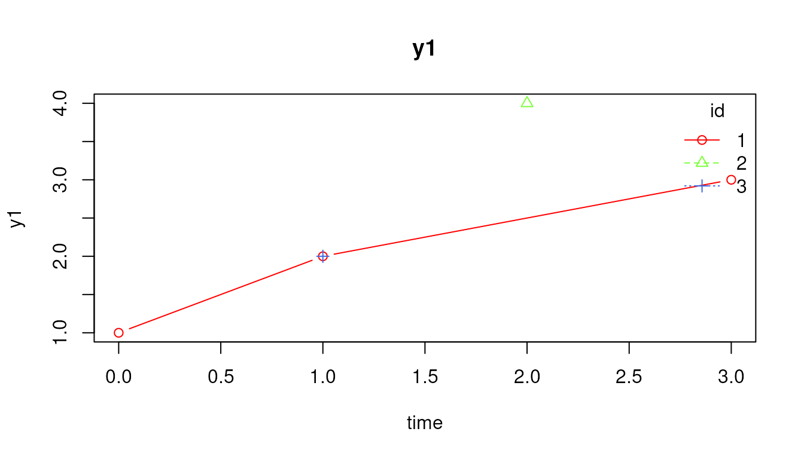
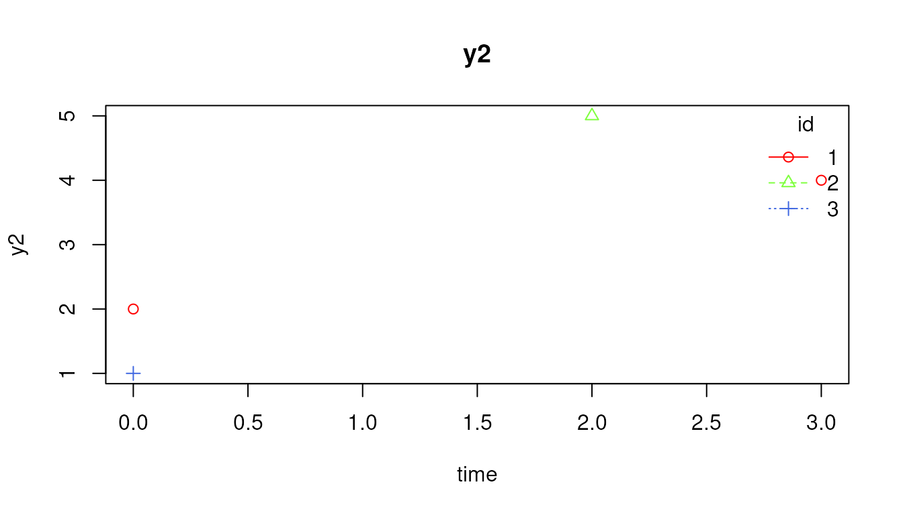
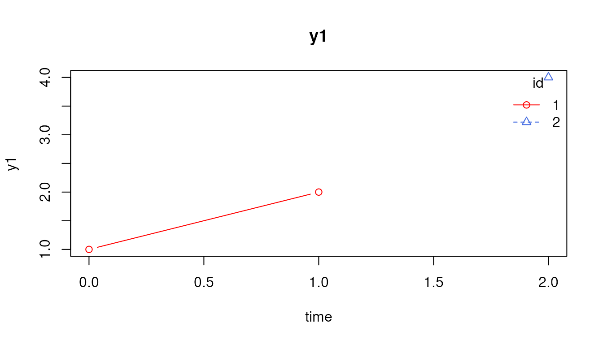
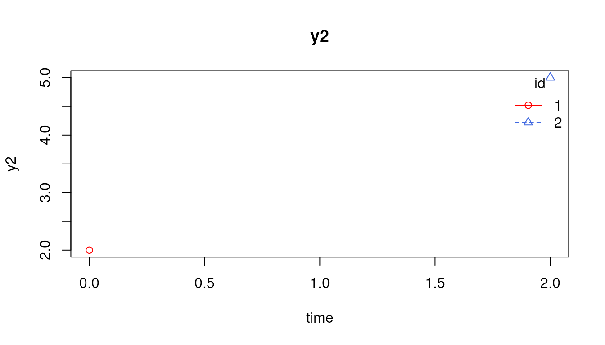
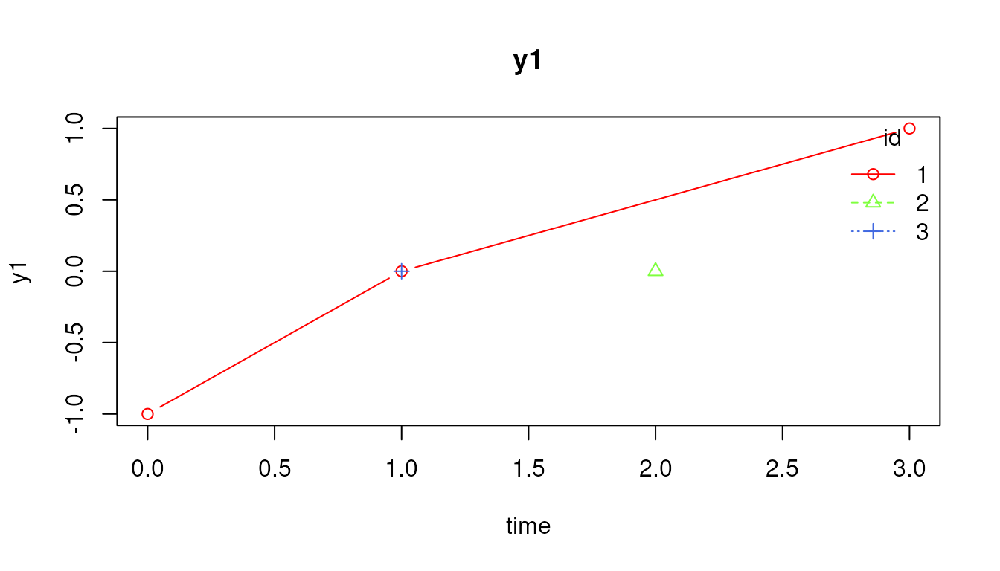
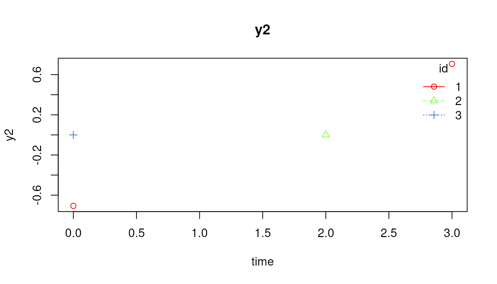

# Diagnosing Dynamic Data Step by Step

This vignette shows a transparent preprocessing and diagnostic workflow
for intensive longitudinal or dynamic modeling data. The goal is to make
each decision inspectable rather than hiding all decisions inside one
large preprocessing wrapper.

[`library`](https://rdrr.io/r/base/library.html)`(`[`dynTools`](https://github.com/jeksterslab/dynTools)`)`` `` ``data`` ``<-`` `[`data.frame`](https://rdrr.io/r/base/data.frame.html)`(`` `` id ``=`` `[`c`](https://rdrr.io/r/base/c.html)`(``1``, ``1``, ``1``, ``2``, ``2``, ``2``, ``3``, ``3``)``,`` `` time ``=`` `[`c`](https://rdrr.io/r/base/c.html)`(``0``, ``1``, ``3``, ``0``, ``1``, ``2``, ``0``, ``1``)``,`` `` y1 ``=`` `[`c`](https://rdrr.io/r/base/c.html)`(``1``, ``2``, ``3``, ``NA``, ``NA``, ``4``, ``Inf``, ``2``)``,`` `` y2 ``=`` `[`c`](https://rdrr.io/r/base/c.html)`(``2``, ``NA``, ``4``, ``NA``, ``NA``, ``5``, ``1``, ``NaN``)``,`` `` cov ``=`` `[`c`](https://rdrr.io/r/base/c.html)`(``10``, ``11``, ``13``, ``20``, ``21``, ``22``, ``30``, ``31``)`` ``)`` `` ``id`` ``<-`` ``"id"`` ``time`` ``<-`` ``"time"`` ``observed`` ``<-`` `[`c`](https://rdrr.io/r/base/c.html)`(``"y1"``, ``"y2"``)`` ``covariates`` ``<-`` ``"cov"`

## 1. Check structure

[`CheckDynData`](https://github.com/jeksterslab/dynTools/reference/CheckDynData.md)`(`` `` data ``=`` ``data``,`` `` id ``=`` ``id``,`` `` time ``=`` ``time``,`` `` observed ``=`` ``observed``,`` `` covariates ``=`` ``covariates``,`` `` require_unique ``=`` ``FALSE``,`` `` require_numeric_time ``=`` ``TRUE``,`` `` require_numeric_observed ``=`` ``TRUE``,`` `` require_numeric_covariates ``=`` ``FALSE``,`` `` min_rows ``=`` ``1L`` ``)`

## 2. Visualize trajectories by ID

A visual check is a useful first diagnostic step.
[`PlotByID()`](https://github.com/jeksterslab/dynTools/reference/PlotByID.md)
overlays the observed trajectories by ID. Non-finite observed values
such as `NaN`, `Inf`, and `-Inf` are treated as missing for plotting,
but they should still be addressed explicitly in the numerical
diagnostics.

[`PlotByID`](https://github.com/jeksterslab/dynTools/reference/PlotByID.md)`(`` `` data ``=`` ``data``,`` `` id ``=`` ``id``,`` `` time ``=`` ``time``,`` `` observed ``=`` ``observed``,`` `` legend ``=`` ``TRUE``,`` `` ask ``=`` ``FALSE`` ``)`

The same plot can be restricted to a subset of IDs or a time range when
there are many individuals or many occasions.

[`PlotByID`](https://github.com/jeksterslab/dynTools/reference/PlotByID.md)`(`` `` data ``=`` ``data``,`` `` id ``=`` ``id``,`` `` time ``=`` ``time``,`` `` observed ``=`` ``observed``,`` `` ids ``=`` `[`c`](https://rdrr.io/r/base/c.html)`(``1``, ``2``)``,`` `` times ``=`` `[`c`](https://rdrr.io/r/base/c.html)`(``0``, ``2``)``,`` `` legend ``=`` ``TRUE``,`` `` ask ``=`` ``FALSE`` ``)`

## 3. Remove rows with no finite observed values

[`DeleteObservedAllNA()`](https://github.com/jeksterslab/dynTools/reference/DeleteObservedAllNA.md)
is useful when rows with no observed measurements should not contribute
to elapsed-time construction or modeling.

`data_rows`` ``<-`` `[`DeleteObservedAllNA`](https://github.com/jeksterslab/dynTools/reference/DeleteObservedAllNA.md)`(`` `` data ``=`` ``data``,`` `` id ``=`` ``id``,`` `` time ``=`` ``time``,`` `` observed ``=`` ``observed``,`` `` covariates ``=`` ``covariates`` ``)`` `` ``data_rows`` ``#> id time y1 y2 cov`` ``#> 1 1 0 1 2 10`` ``#> 2 1 1 2 NA 11`` ``#> 3 1 3 3 4 13`` ``#> 4 2 2 4 5 22`` ``#> 5 3 0 Inf 1 30`` ``#> 6 3 1 2 NaN 31`

## 4. Diagnose IDs before dropping anything

`diagnostics`` ``<-`` `[`DiagnosticsByID`](https://github.com/jeksterslab/dynTools/reference/DiagnosticsByID.md)`(`` `` data ``=`` ``data_rows``,`` `` id ``=`` ``id``,`` `` time ``=`` ``time``,`` `` observed ``=`` ``observed``,`` `` covariates ``=`` ``covariates``,`` `` min_nonmissing ``=`` ``1L``,`` `` extreme_cut ``=`` `[`c`](https://rdrr.io/r/base/c.html)`(``4``, ``5``, ``6``)``,`` `` sd_cut ``=`` `[`c`](https://rdrr.io/r/base/c.html)`(``0.10``, ``0.05``)`` ``)`` `` ``diagnostics`` ``#> id n_rows n_observed_rows n_complete_rows prop_all_missing`` ``#> 1 1 3 3 2 0`` ``#> 2 2 1 1 1 0`` ``#> 3 3 2 2 0 0`` ``#> n_duplicate_id_time n_nan_total n_inf_total n_nonfinite_total min_time`` ``#> 1 0 0 0 0 0`` ``#> 2 0 0 0 0 2`` ``#> 3 0 1 1 2 0`` ``#> max_time max_obs_gap median_obs_gap mean_obs_gap miss_y1 n_y1 n_finite_y1`` ``#> 1 3 2 1.5 1.5 0 3 3`` ``#> 2 2 NA NA NA 0 1 1`` ``#> 3 1 1 1.0 1.0 0 2 1`` ``#> n_nan_y1 n_inf_y1 n_nonfinite_y1 sd_y1 maxabs_y1 n_abs_gt4_y1 n_abs_gt5_y1`` ``#> 1 0 0 0 1 3 0 0`` ``#> 2 0 0 0 NA 4 0 0`` ``#> 3 0 1 1 NA 2 0 0`` ``#> n_abs_gt6_y1 miss_y2 n_y2 n_finite_y2 n_nan_y2 n_inf_y2 n_nonfinite_y2`` ``#> 1 0 0.3333333 2 2 0 0 0`` ``#> 2 0 0.0000000 1 1 0 0 0`` ``#> 3 0 0.5000000 1 1 1 0 1`` ``#> sd_y2 maxabs_y2 n_abs_gt4_y2 n_abs_gt5_y2 n_abs_gt6_y2 min_sd median_sd`` ``#> 1 1.414214 4 0 0 0 1 1.207107`` ``#> 2 NA 5 1 0 0 NA NA`` ``#> 3 NA 1 0 0 0 NA NA`` ``#> min_sd_variable max_abs_any max_abs_variable n_var_sd_lt_0_1 n_var_sd_lt_0_05`` ``#> 1 y1 4 y2 0 0`` ``#> 2 <NA> 5 y2 0 0`` ``#> 3 <NA> 2 y1 0 0`` ``#> n_abs_gt4_total n_abs_gt5_total n_abs_gt6_total`` ``#> 1 0 0 0`` ``#> 2 1 0 0`` ``#> 3 0 0 0`

## 5. Convert diagnostics to flags

`flags`` ``<-`` `[`FlagDiagnosticsByID`](https://github.com/jeksterslab/dynTools/reference/FlagDiagnosticsByID.md)`(`` `` x ``=`` ``diagnostics``,`` `` min_observed_rows ``=`` ``2L``,`` `` min_complete_rows ``=`` ``NULL``,`` `` max_prop_all_missing ``=`` ``0.95``,`` `` max_gap ``=`` ``NULL``,`` `` max_median_gap ``=`` ``NULL``,`` `` min_sd ``=`` ``NULL``,`` `` extreme_cut ``=`` ``6``,`` `` drop_score_cut ``=`` ``2L`` ``)`` `` ``flags``[``flags``$``flag_any``, `[`c`](https://rdrr.io/r/base/c.html)`(``"id"``, ``"priority_score"``, ``"flag_reason"``)``]`` ``#> id priority_score flag_reason`` ``#> 2 2 1 n_obs_lt_2`` ``#> 3 3 1 nonfinite_observed`

## 6. Choose sensitivity-analysis candidates

`drop_id`` ``<-`` `[`GetDropID`](https://github.com/jeksterslab/dynTools/reference/GetDropID.md)`(`` `` x ``=`` ``flags``,`` `` flagged_only ``=`` ``TRUE`` ``)`` `` ``drop_id`` ``#> [1] 2`

The returned IDs are candidates for exclusion or sensitivity analysis,
not automatic exclusions.

## 7. Optional detrending and scaling diagnostics

`scale_diagnostics`` ``<-`` `[`DiagnoseScaleByID`](https://github.com/jeksterslab/dynTools/reference/DiagnoseScaleByID.md)`(`` `` data ``=`` ``data_rows``,`` `` id ``=`` ``id``,`` `` time ``=`` ``time``,`` `` observed ``=`` ``observed``,`` `` sd_min ``=`` ``0.10``,`` `` z_cut ``=`` ``6``,`` `` min_n ``=`` ``2L``,`` `` flagged_only ``=`` ``FALSE`` ``)`` `` ``scale_diagnostics`` ``#> id variable n_total n_finite n_missing n_na n_nan n_inf mean sd min max`` ``#> 1 1 y1 3 3 0 0 0 0 2 1.000000 1 3`` ``#> 2 1 y2 3 2 1 1 0 0 3 1.414214 2 4`` ``#> 3 2 y1 1 1 0 0 0 0 4 NA 4 4`` ``#> 4 2 y2 1 1 0 0 0 0 5 NA 5 5`` ``#> 5 3 y1 2 1 1 0 0 1 2 NA 2 2`` ``#> 6 3 y2 2 1 1 1 1 0 1 NA 1 1`` ``#> range max_abs min_z_after_scaling max_z_after_scaling max_abs_z_after_scaling`` ``#> 1 2 3 -1.0000000 1.0000000 1.0000000`` ``#> 2 2 4 -0.7071068 0.7071068 0.7071068`` ``#> 3 0 4 NA NA NA`` ``#> 4 0 5 NA NA NA`` ``#> 5 0 2 NA NA NA`` ``#> 6 0 1 NA NA NA`` ``#> time_max_abs_z value_max_abs_z row_max_abs_z flag_low_n flag_nonfinite`` ``#> 1 0 1 1 FALSE FALSE`` ``#> 2 0 2 1 FALSE FALSE`` ``#> 3 NA NA NA TRUE FALSE`` ``#> 4 NA NA NA TRUE FALSE`` ``#> 5 NA NA NA TRUE TRUE`` ``#> 6 NA NA NA TRUE TRUE`` ``#> flag_zero_sd flag_low_sd flag_extreme_z flag`` ``#> 1 FALSE FALSE FALSE FALSE`` ``#> 2 FALSE FALSE FALSE FALSE`` ``#> 3 FALSE FALSE FALSE TRUE`` ``#> 4 FALSE FALSE FALSE TRUE`` ``#> 5 FALSE FALSE FALSE TRUE`` ``#> 6 FALSE FALSE FALSE TRUE`

## 8. Optional transformations

After inspecting diagnostics, apply transformations explicitly.

`data_scaled`` ``<-`` `[`ScaleByID`](https://github.com/jeksterslab/dynTools/reference/ScaleByID.md)`(`` `` data ``=`` ``data_rows``,`` `` id ``=`` ``id``,`` `` time ``=`` ``time``,`` `` observed ``=`` ``observed``,`` `` covariates ``=`` ``NULL`` ``)`` `` ``data_scaled`` ``#> id time y1 y2`` ``#> 1 1 0 -1 -0.7071068`` ``#> 2 1 1 0 NA`` ``#> 3 1 3 1 0.7071068`` ``#> 4 2 2 0 0.0000000`` ``#> 5 3 0 NA 0.0000000`` ``#> 6 3 1 0 NA`

The transformed data can also be plotted as a final check.

[`PlotByID`](https://github.com/jeksterslab/dynTools/reference/PlotByID.md)`(`` `` data ``=`` ``data_scaled``,`` `` id ``=`` ``id``,`` `` time ``=`` ``time``,`` `` observed ``=`` ``observed``,`` `` legend ``=`` ``TRUE``,`` `` ask ``=`` ``FALSE`` ``)`

This step-by-step workflow keeps the audit trail clear: diagnose first,
decide second, transform third.
